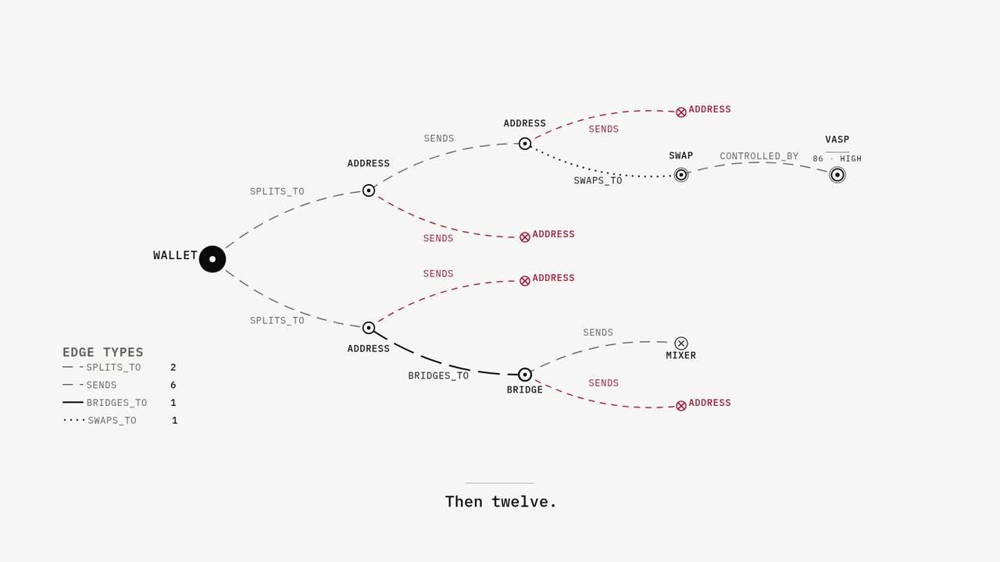
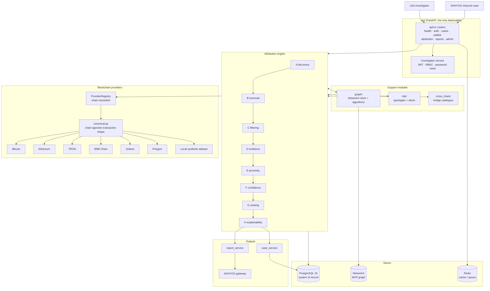

# ChainSleuth: Cross-Chain VASP Wallet Attribution

[](https://github.com/MEDUSA-SIH/Chainsleuth/actions/workflows/ci.yml)
[](api/pyproject.toml)
[](https://docs.astral.sh/ruff/)
[](#license)
[](#overview)
[](CONTRIBUTING.md)

> **Smart India Hackathon 2026 · Problem Statement SIH26182**
> Sponsoring organisation: **Ministry of Home Affairs (MHA) · Indian Cyber Crime Coordination Centre (I4C) · CIS Division**

ChainSleuth traces a suspect cryptocurrency wallet to the **nearest VASP** (a Virtual Asset Service Provider such as an exchange, custodial wallet provider, or broker) across Bitcoin, Ethereum, TRON, BNB Chain, Solana, and Polygon, then routes an analyst-approved disclosure or freeze request back through the **SAHYOG** inter-agency gateway.

### Project film

<p align="center">
  <a href="docs/media/chainsleuth-demo.mp4">
    
  </a>
</p>

<p align="center"><sub>Project film, 1:59. Click the image to play.</sub></p>

---

## Table of Contents

- [Overview](#overview)
- [Key Capabilities](#key-capabilities)
- [Architecture](#architecture)
- [Repository Layout](#repository-layout)
- [How the Code is Organized](#how-the-code-is-organized)
- [Requirements](#requirements)
- [Quick Start](#quick-start)
- [Configuration](#configuration)
- [Offline Demo: 8 Synthetic Cases](#offline-demo-8-synthetic-cases)
- [API Reference](#api-reference)
- [Testing, Linting, Migrations](#testing-linting-migrations)
- [Documentation Map](#documentation-map)
- [Security](#security)
- [Contributing](#contributing)
- [Roadmap](#roadmap)
- [License](#license)
- [Acknowledgements](#acknowledgements)

---

## Overview

Indian law enforcement agencies routinely encounter **pseudonymous, unhosted wallets** linked to fraud, ransomware, investment scams, and laundering. Today an investigator has to follow a wallet's fund flows hop by hop across multiple block explorers, check each address against tribal knowledge of exchange wallets, and assemble a disclosure request by hand. That process is measured in hours to days. The result is inconsistent attribution, weak evidentiary trails, and missed windows for asset freezing.

This repository implements the backend for **SIH26182**, an automated and explainable multi-chain attribution system that:

1. **Ingests** a suspect wallet address, from the SAHYOG portal or directly through the API.
2. **Traces** its transaction graph across supported chains behind a single `BlockchainProvider` abstraction.
3. **Discovers** the nearest VASP-controlled deposit address by directed graph distance, not by geography or transaction volume.
4. **Scores** every candidate with two independent numbers: a **proximity rank** (how close) and a **confidence score** with an **evidence tier** (how credible). The two are never blended into a single number.
5. **Explains** each candidate in plain language and produces an investigation-ready evidence package.
6. **Routes** the analyst-approved disclosure or freeze request back through SAHYOG to the correct legal entity.

The system is **offline-first**. With `DEMO_MODE=true` (the default), the entire pipeline runs against a deterministic synthetic dataset with no live chain API keys, so every contributor, reviewer, and evaluator can reproduce attribution end to end.

---

## Key Capabilities

- **Multi-chain by design.** Every supported chain is one adapter behind a single `BlockchainProvider` ABC (`api/app/providers/base.py`): Bitcoin, Ethereum, TRON, and BNB Chain are wired to live explorer APIs, and Solana and Polygon follow the same contract. Adding a chain is a new adapter, not a rewrite (see `docs/phases-mapping.md`, Phase 20, REQ-007).
- **Deterministic offline demo.** `DEMO_MODE=true` serves all eight synthetic investigation patterns through the same interface as live providers. No explorer keys required.
- **Explainable attribution.** The eight stages (discovery, traversal, filtering, evidence, proximity, confidence, ranking, explainability) are isolated, individually unit-tested functions. `AttributionEngine.run` is the only public entry point.
- **Two scores, never one.** Proximity and confidence are independent. Each candidate also carries an `evidence_tier` and a plain-language `explanation`.
- **Evidence-first, not guess-first.** `POST /api/v1/attribution/run` returns an `outcome` and an `insufficient_evidence` flag rather than inventing an answer. A mixer hit forces confidence `0.0` / `low`.
- **Investigator authentication.** JWT login, RBAC role guards, token versioning, password reset with TTL, and admin investigator CRUD, all covered by schema, service, and API tests.
- **Graph analytics.** Community detection, PageRank, and time-window traversal over the NetworkX store.
- **Frozen contracts.** Public interfaces are specified in `docs/contracts.md`; a breaking change requires a `BREAKING CHANGE:` footer.

---

## Architecture



Layer detail with precise paths, attribution flow, and design decisions: [`docs/architecture.md`](docs/architecture.md).
Where every file lives and where new code goes: [`docs/repo-structure.md`](docs/repo-structure.md).

---

## Repository Layout

```
Chainsleuth/
├── api/                        # FastAPI service, the only deployable
│   ├── app/
│   │   ├── api/v1/             # Routers: health, auth, cases, wallets,
│   │   │                       #   attribution, reports, admin, admin_investigators
│   │   ├── attribution/        # engine.py (public) + 8 stage modules + types
│   │   ├── core/               # security (JWT/bcrypt/RBAC), logging, exceptions
│   │   ├── cross_chain/        # Bridge catalogue
│   │   ├── db/                 # Database models + session
│   │   ├── graph/              # NetworkX store + algorithms
│   │   ├── providers/          # BlockchainProvider ABC, factory, canonical,
│   │   │                       #   bitcoin, ethereum, tron, bnb, solana, polygon, local dataset
│   │   ├── risk/               # Typologies + alerts
│   │   ├── sahyog/             # SAHYOG gateway adapter
│   │   ├── schemas/            # Pydantic request/response models
│   │   ├── services/           # Orchestration: attribution, case, report, investigator
│   │   ├── workers/            # Background tasks
│   │   ├── config.py           # pydantic-settings
│   │   └── main.py             # Lifespan + router wiring
│   ├── alembic/versions/       # 0001_initial, 0002_auth_rbac
│   ├── scripts/                # seed_demo_data, create_investigator, create_db
│   ├── tests/                  # unit + integration tests
│   ├── Dockerfile              # Multi-stage, non-root, healthcheck on /api/v1/health
│   └── pyproject.toml          # Service dependencies (hatchling)
├── data/synthetic/             # Offline demo dataset, 8 synthetic cases
├── docs/                       # Architecture, contracts, development, glossary,
│   │                           #   phases-mapping, repo-structure
│   └── media/                  # Project film
├── frontend/                   # VASPTrace landing page (static HTML/CSS/JS)
├── scripts/                    # bootstrap.sh, check.sh
├── .github/                    # CI, issue templates, CODEOWNERS, ruleset
├── docker-compose.yml          # postgres 16 + redis 7 + api (local dev)
├── Makefile                    # up/down/logs/migrate/test/lint/format/check/seed-demo
├── pyproject.toml              # Workspace lint config (ruff)
├── .env.example                # Environment template (never commit a real .env)
├── CONTRIBUTING.md             # Branching, Conventional Commits, PR checklist
├── SECURITY.md                 # Private disclosure policy, threat model, secure coding
└── LICENSE                     # Proprietary licence terms
```

Local-only working directories (`.private/` for renders and tool caches, `.sih/` for internal drafts) are git-ignored as whole directories and are absent from a fresh clone. Neither is needed to build, test, or run the API.

Folder to SIH phase mapping: [`docs/phases-mapping.md`](docs/phases-mapping.md).
Full file ownership and where new code goes: [`docs/repo-structure.md`](docs/repo-structure.md).

---

## How the Code is Organized

The attribution engine runs in eight steps, each isolated in its own file:

| Step | File | What it does |
|------|------|--------------|
| **A, Discovery** | `attribution/discovery.py` | Finds candidate wallets by walking the transaction graph |
| **B, Traversal** | `attribution/traversal.py` | Rebuilds the full path to each candidate |
| **C, Filtering** | `attribution/filtering.py` | Removes noise such as dust, duplicates, and high-degree hubs |
| **D, Evidence** | `attribution/evidence.py` | Gathers supporting evidence and assigns the evidence tier |
| **E, Proximity** | `attribution/scoring.py` | Scores how close each candidate is |
| **F, Confidence** | `attribution/scoring.py` | Scores how trustworthy each match is |
| **G, Ranking** | `attribution/ranking.py` | Sorts by proximity and classifies the outcome |
| **H, Explanation** | `attribution/explainability.py` | Writes a plain-English explanation per candidate |

`attribution/engine.py` is the only module outsiders import. The offline demo dataset in `data/synthetic/` lets the whole pipeline run without live blockchain APIs: with `DEMO_MODE` on the app uses the demo data, with it off the app uses the per-chain providers.

Full layered view: [`docs/architecture.md`](docs/architecture.md). Plain-language glossary of VASP, mixer, bridge, evidence tiers, and phase terminology: [`docs/glossary.md`](docs/glossary.md).

---

## Requirements

### System

| Component | Minimum | Recommended | Notes |
|-----------|---------|-------------|-------|
| **OS** | Linux (Ubuntu 22.04+), macOS 13+, or Windows 11 + WSL2 | Ubuntu 22.04 LTS | Docker Desktop required on macOS/Windows |
| **CPU / RAM** | 2 vCPU / 4 GB RAM | 4 vCPU / 8 GB RAM | The engine is CPU-bound; graph traversal benefits from more RAM |
| **Disk** | 10 GB free | 20 GB free | Docker images, Postgres data, synthetic dataset |
| **Python** | **3.12** (as used in CI) | 3.12.x | Tests and production target 3.12 |
| **Docker** | Engine 24+ + Compose v2 | Latest stable | Required for `postgres:16-alpine` + `redis:7-alpine` + the API container |
| **Network** | Outbound HTTPS for `pip` and `uv` | n/a | No live blockchain API needed when `DEMO_MODE=true` |

### Software

| Tool | Version | Purpose | Install |
|------|---------|---------|---------|
| `git` | 2.40+ | Clone and branch | `sudo apt install git` / `brew install git` |
| `docker` + `docker compose` | Engine 24+, Compose v2 | Run the full stack | <https://docs.docker.com/get-docker/> |
| `python` | 3.12 | Local runs and CI | <https://www.python.org/downloads/> |
| `uv` | 0.4+ (optional) | Fast installs and virtualenvs | `curl -LsSf https://astral.sh/uv/install.sh \| sh` |
| `make` | 4.3+ | Shortcuts (`make up`, `make test`, …) | `sudo apt install make` / Xcode CLT on macOS |

Verify once:

```bash
python3 --version   # should print Python 3.12.x
docker --version    # should print Docker version 24+
docker compose version  # should print v2.x
make --version
```

### Environment template

Copy and edit the env file **before** the first run. Never commit a real `.env`.

```bash
cp .env.example .env
# Defaults are safe for the demo: DEMO_MODE=true, Postgres on localhost:5432,
# Redis on localhost:6379.
```

See [Configuration](#configuration) for the full variable list.

---

## Quick Start

### Option A: Docker Compose (one command)

```bash
cp .env.example .env          # skip if already done
docker compose up -d --build
docker compose exec api alembic upgrade head   # or: make migrate
curl http://localhost:8000/api/v1/health
# {"status":"ok","demo_mode":true,"version":"0.1.0"}
```

API: `http://localhost:8000` · Swagger: `http://localhost:8000/docs` · ReDoc: `/redoc`
Tear down with `docker compose down` or `make down`.

### Option B: Local Python (API outside Docker)

```bash
# 1. Start only the data services
docker compose up -d postgres redis

# 2. Run the API locally
cd api
uv venv --python 3.12
uv pip install -e ".[dev]"
cp ../.env.example .env       # ensure POSTGRES_HOST=localhost, REDIS_HOST=localhost
uvicorn app.main:app --reload --port 8000

# 3. In another terminal, apply migrations and check health
curl http://localhost:8000/api/v1/health
```

### Verify the setup

```bash
curl -s http://localhost:8000/api/v1/health | jq
# {"status":"ok","demo_mode":true,"version":"0.1.0"}

# Run the full offline demo (no API keys needed)
curl -s -X POST http://localhost:8000/api/v1/attribution/run \
  -H 'content-type: application/json' \
  -d '{"suspect_address":"0xDEMO_case1_suspect_001","chain":"ethereum"}' | jq '.outcome'
# "single_candidate"
```

If either check fails, see `make logs` (Docker) or the `uvicorn` output (local) and [`docs/development.md`](docs/development.md).

Ports used: **8000** (API), **5432** (Postgres), **6379** (Redis). Override in `.env` if occupied.

---

## Configuration

Settings load through `pydantic-settings` from environment variables or `.env` (`api/app/config.py`). Never commit a real `.env`.

| Variable | Default | Purpose |
|----------|---------|---------|
| `DEMO_MODE` | `true` | **Offline demo toggle.** When `true`, every chain is served from the local synthetic dataset and no API keys are needed. When `false`, the per-chain providers are used and a disabled chain raises until it is enabled. |
| `SECRET_KEY` | `change-me` | JWT signing key. Override this in every non-demo deployment. |
| `POSTGRES_HOST` / `POSTGRES_PORT` / `POSTGRES_USER` / `POSTGRES_PASSWORD` / `POSTGRES_DB` | `localhost` / `5432` / `sih26182` / `sih26182` / `sih26182` | Postgres connection. Docker Compose sets the host to `postgres` automatically. |
| `REDIS_HOST` / `REDIS_PORT` | `localhost` / `6379` | Redis for cache and queue. |
| `ATTRIBUTION_MAX_HOPS` | `5` | How far the engine walks the transaction graph. |
| `PROVIDER_*_ENABLED` | `false`, except `PROVIDER_DEMO_ENABLED=true` | Per-chain toggles for `bitcoin`, `ethereum`, `tron`, `bnb`, `solana`, `polygon`. |
| `BLOCKCHAIN_API_KEY` + `*_PROVIDER_URL` | empty | Live provider credentials and endpoints. Never commit real keys. |
| `SAHYOG_ENABLED` / `SAHYOG_BASE_URL` / `SAHYOG_API_KEY` | `false` / empty | SAHYOG adapter settings. |

Full list: [`.env.example`](.env.example).

---

## Offline Demo: 8 Synthetic Cases

With `DEMO_MODE=true` the synthetic dataset in `data/synthetic/` is queryable through the same `BlockchainProvider` interface as a real chain.

### Seed (idempotent)

```bash
make seed-demo
# or: cd api && python -m scripts.seed_demo_data
```

The seed is best-effort with respect to the database: it always loads the in-memory demo indexes and additionally upserts to Postgres when it is reachable.

### Run attribution

```bash
# Case 1: direct VASP deposit, expect single_candidate, tier 1, high confidence
curl -s -X POST http://localhost:8000/api/v1/attribution/run \
  -H 'content-type: application/json' \
  -d '{"suspect_address":"0xDEMO_case1_suspect_001","chain":"ethereum"}' | jq

# Case 5: mixer hit, expect insufficient_evidence, confidence 0
curl -s -X POST http://localhost:8000/api/v1/attribution/run \
  -H 'content-type: application/json' \
  -d '{"suspect_address":"0xDEMO_case5_suspect_001","chain":"ethereum"}' | jq
```

All eight patterns are also covered by `api/tests/integration/test_attribution_smoke.py`:

| Case | Pattern | Expected `outcome` | Tier | Confidence |
|------|---------|-------------------|------|------------|
| 1 | Direct VASP deposit | `single_candidate` | 1 | ~78 high |
| 2 | One intermediary | `single_candidate` | 2 | ~78 high |
| 3 | Multiple intermediaries | `single_candidate` | 3 | ~82 high |
| 4 | Multiple candidate VASPs | `ranked_multi_candidate` | 2 | ~78 high |
| 5 | Mixer | `insufficient_evidence` | 99 | 0.0 low |
| 6 | Bridge (cross-chain) | `single_candidate` | 3 | ~74 high |
| 7 | False candidate (high-degree hub) | `false_candidate_filtered` | 4 | ~49 medium |
| 8 | Ambiguous / insufficient | `insufficient_evidence` | 4 | ~33 low |

### How scoring works

Two independent numbers per candidate, never blended:

- **`proximity_rank`**, how close the candidate is. Lower is closer. Based on hops, with penalties for mixers, bridges, and stale activity. The ranking stage sorts on this.
- **`confidence_score`**, a value from 0 to 100 for how trustworthy the match is. This is an equal-weight average of six baseline signals: evidence tier, label agreement, address reuse, cluster consistency, path integrity, and freshness. Bands: `high` ≥70, `medium` 40 to 69, `low` <40. Mixer hits are hard-stopped to `0.0` / `low`.

The factor set is designed to be extensible, so new signals can be added without redefining the score. Full breakdown: [`docs/development.md`](docs/development.md).

---

## API Reference

All routes are mounted under `/api/v1` and described in [`docs/contracts.md`](docs/contracts.md) §7.

| Method | Path | Description |
|--------|------|-------------|
| `GET` | `/api/v1/health` | Liveness check, returns status, demo mode, and version |
| `POST` | `/api/v1/attribution/run` | Run the multi-stage engine. Body: `{suspect_address, chain, case_id?, max_hops?}`. Returns the outcome, candidates, and explanations. |
| `POST` | `/api/v1/auth/login` | Exchange credentials for a token |
| `POST` | `/api/v1/auth/logout` | Revoke the current token |
| `GET` | `/api/v1/auth/me` | Current investigator profile |
| `POST` | `/api/v1/auth/change-password` | Change the current investigator password |
| `POST` | `/api/v1/auth/password-reset/*` | Request and confirm a password reset |
| `GET` / `POST` | `/api/v1/cases` | List and create cases |
| `GET` | `/api/v1/cases/{case_id}` | Fetch a single case |
| `GET` / `POST` | `/api/v1/wallets` | Wallet and graph queries |
| `GET` | `/api/v1/wallets/{wallet_id}` | Fetch a single wallet |
| `POST` | `/api/v1/reports/generate` | Generate an investigation report |
| `GET` | `/api/v1/admin/settings` | Show resolved non-secret settings |
| `GET` / `POST` / `PATCH` | `/api/v1/admin/investigators…` | Investigator admin and password reset (admin role required) |

Interactive documentation while the API is running: `/docs` (Swagger UI) and `/redoc`.

---

## Testing, Linting, Migrations

| Task | Command | Notes |
|------|---------|-------|
| Bring the stack up | `make up` | `docker compose up -d --build` |
| Tail API logs | `make logs` | `docker compose logs -f api` |
| Open an API shell | `make shell` | `docker compose exec api bash` |
| Apply migrations | `make migrate` | `docker compose exec api alembic upgrade head` |
| New migration | `make revision m="add foo"` | Generates `api/alembic/versions/NNNN_*.py` |
| Run tests | `make test` | In the container; locally `uv run pytest api/tests -q` |
| Lint | `make lint` | `ruff check api/` (CI additionally lints `packages/`) |
| Format | `make format` | `ruff format api/` |
| Quick sanity | `make check` | `scripts/check.sh`, which runs ruff, an import smoke test, and a YAML check |
| Seed demo data | `make seed-demo` | `docker compose exec api python -m scripts.seed_demo_data` |
| Pre-commit hooks | `make install-hooks` · `make pre-commit` | `ruff` and `ruff-format` |

Tests live under `api/tests/unit/` and `api/tests/integration/` and cover the engine stages, providers, graph, auth, and the offline demo path.

CI ([`.github/workflows/ci.yml`](.github/workflows/ci.yml)) lints, smoke-tests imports, and runs pytest with Postgres and Redis services on every push and pull request to `main`. Keep it green before merging.

---

## Documentation Map

| Doc | What it answers |
|-----|-----------------|
| [`docs/architecture.md`](docs/architecture.md) | Layered design, cross-cutting concerns, data stores, provider strategy, the A to H pipeline, deployment |
| [`docs/contracts.md`](docs/contracts.md) | Public interfaces: `BlockchainProvider`, `CanonicalTransaction`, `AttributionEngine`, `GraphStore`, `SahyogGateway`, `Settings`, routers, ORM, migrations |
| [`docs/phases-mapping.md`](docs/phases-mapping.md) | Folder to SIH phase mapping for the entire repository |
| [`docs/repo-structure.md`](docs/repo-structure.md) | Where every file lives and where new code should go |
| [`docs/development.md`](docs/development.md) | Day-to-day setup, offline demo walkthrough, scoring design, adding a model or provider |
| [`docs/glossary.md`](docs/glossary.md) | Plain-language glossary. Start here if terms like "evidence tier" mean nothing yet |
| [`CONTRIBUTING.md`](CONTRIBUTING.md) | Branching model, workflow, Conventional Commits, PR checklist, code style |
| [`SECURITY.md`](SECURITY.md) | Private disclosure, supported versions, threat model, secure coding, dependency and secrets handling |

---

## Security

See [`SECURITY.md`](SECURITY.md) for the full policy. **Do not file a public issue for a suspected vulnerability.** Open a private GitHub Security Advisory instead (`Security`, then `Advisories`, then `New draft advisory`). We aim to acknowledge reports within 2 business days.

If you deploy beyond the demo, override `SECRET_KEY`, set `DEMO_MODE=false`, and supply real chain provider credentials. The scaffold defaults are not safe for public networks.

---

## Contributing

Please read [`CONTRIBUTING.md`](CONTRIBUTING.md) before opening a pull request.

- Keep each pull request focused on one area. If it touches code owned by another area, get approval from that path CODEOWNER first.
- `main` is the only integration branch in this repository.
- Public interfaces are described in `docs/contracts.md`. If you change one, mark it with a `BREAKING CHANGE:` footer.
- Every pull request must pass CI (lint + import smoke + pytest) and update the docs when behaviour changes.

---

## Roadmap

| Area | Direction |
|------|-----------|
| Demo + engine | Offline demo dataset and the attribution pipeline |
| Providers | Chain adapters behind one provider interface |
| Auth | Investigator accounts, roles, and password flows |
| Graph | Network store, community and ranking algorithms |
| Reporting | Case handling, evidence packaging, and reports |
| Deployment | Workers, observability, hardening, manifests |


---

## License

Proprietary, as a Smart India Hackathon 2026 submission. All rights reserved. No licence is granted for reuse outside the SIH evaluation context. See [LICENSE](LICENSE).

---

## Acknowledgements

Problem statement and sponsorship: **Ministry of Home Affairs, I4C, CIS Division**, via Smart India Hackathon 2026. Built by the **MEDUSA** team.

Off-chain intelligence patterns and the VASP and evidence-tier definitions are informed by public FATF and PMLA guidance and by published blockchain-intelligence research, adapted here into an explainable MVP for law-enforcement use.