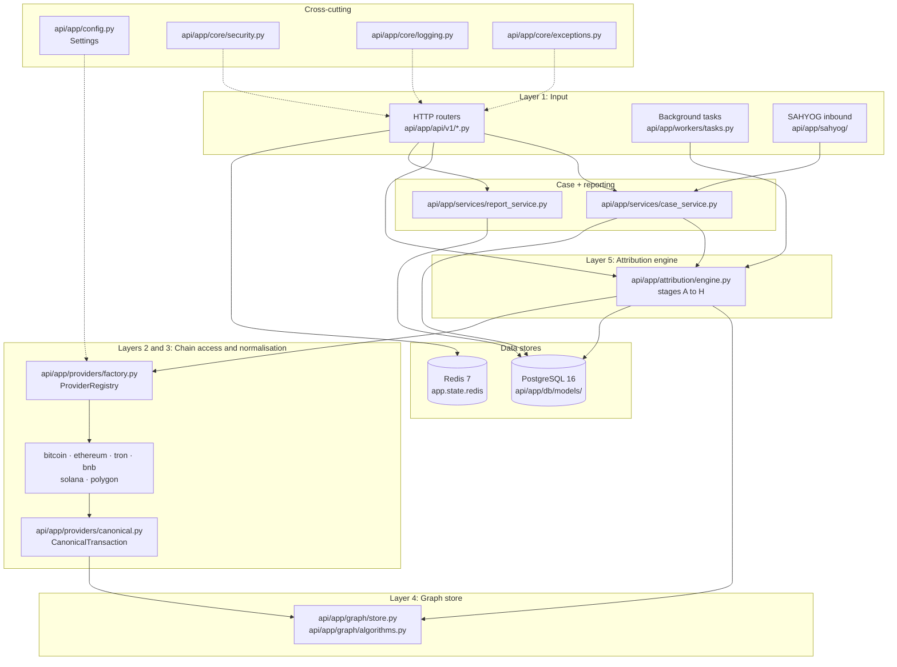

# SIH26182: Architecture

The SIH26182 backend is organised as a **layered pipeline**.  Each layer
consumes the output of the layer immediately below it and exposes a
narrow surface upward.

Layer inventory (module paths below are relative to `api/`):

```
┌──────────────────────────────────────────────────────────────────┐
│  Layer 8  · SAHYOG adapter (Phase 7)                              │
│  app/sahyog/{gateway,models}.py                                   │
├──────────────────────────────────────────────────────────────────┤
│  Layer 7  · Reporting (Phase 17)                                 │
│  app/services/report_service.py, app/api/v1/reports.py            │
├──────────────────────────────────────────────────────────────────┤
│  Layer 6  · Investigation / Case orchestration (Phase 12)         │
│  app/services/case_service.py, app/api/v1/cases.py               │
├──────────────────────────────────────────────────────────────────┤
│  Layer 5  · Attribution engine (Phase 10)                        │
│  app/attribution/{discovery,traversal,filtering,evidence,        │
│                   scoring,ranking,explainability,engine}.py      │
├──────────────────────────────────────────────────────────────────┤
│  Layer 4  · Graph store (Phase 6 + Phase 11)                     │
│  app/graph/{models,store,algorithms}.py                          │
├──────────────────────────────────────────────────────────────────┤
│  Layer 3  · Normalisation (Phase 9)                              │
│  app/providers/canonical.py                                      │
├──────────────────────────────────────────────────────────────────┤
│  Layer 2  · Blockchain intelligence (Phase 20)                   │
│  app/providers/{base,factory,bitcoin,ethereum,tron,bnb,solana,   │
│                 polygon,demo}.py                                  │
├──────────────────────────────────────────────────────────────────┤
│  Layer 1  · Input (HTTP / background / SAHYOG inbound)           │
│  app/api/v1/*.py, app/workers/tasks.py                           │
└──────────────────────────────────────────────────────────────────┘
```

## Request and data flow



## Cross-cutting concerns

These concerns span every layer.

- **Configuration**: `api/app/config.py` (pydantic-settings, `DEMO_MODE`,
  `PROVIDER_*_ENABLED` toggles).
- **Security**: `api/app/core/security.py` (bcrypt hashing, JWT issue and
  verification, role dependencies).
- **Logging**: `api/app/core/logging.py` (structlog).
- **Errors**: `api/app/core/exceptions.py` (typed errors + FastAPI handlers).

## Data stores

| Store          | Role                                  | Phase | File |
|----------------|---------------------------------------|-------|------|
| PostgreSQL 16  | System of record (cases, wallets, …)  | 8     | `api/app/db/models/` |
| NetworkX       | In-process transaction graph (MVP)    | 6, 11 | `api/app/graph/store.py` |
| Redis          | Cache / queue client (wired at startup; queue use is Phase 23) | 23 | `app.state.redis` (lifespan) |

## Provider strategy (Phase 20)

Each chain has its own `BlockchainProvider` implementation:

- `BitcoinProvider`, `EthereumProvider`, `TronProvider`, and `BnbProvider`
  (`api/app/providers/`) call live explorer APIs.
- `SolanaProvider` and `PolygonProvider` implement the same ABC and are
  wired through the registry; their upstream API bindings are the next
  increment.
- `DemoBlockchainProvider` (`api/app/providers/demo.py`) serves the local
  synthetic dataset whenever `DEMO_MODE=true`, so the pipeline is fully
  reproducible without chain credentials.

They all conform to the `BlockchainProvider` ABC and normalise into the
`CanonicalTransaction` shape.  `api/app/providers/factory.py` assembles
them into a `ProviderRegistry`, keyed by chain code, which the FastAPI
lifespan stores on `app.state.provider_registry`.  Toggle each live chain
individually via the `PROVIDER_*_ENABLED` env vars; the registry falls back
to the demo provider for any chain whose live integration is disabled.

## Attribution pipeline (Phase 10)

The engine runs eight stages (A to H).  Each stage is a separate function so
they can be unit-tested and replaced independently:

| Stage | Module                              | Purpose |
|-------|-------------------------------------|---------|
| A     | `attribution/discovery.py`          | resolve seed addresses |
| B     | `attribution/traversal.py`          | BFS/Dijkstra expansion |
| C     | `attribution/filtering.py`          | drop low-signal candidates |
| D     | `attribution/evidence.py`           | assemble evidence snippets |
| E     | `attribution/scoring.py`            | proximity scoring |
| F     | `attribution/scoring.py`            | confidence combination |
| G     | `attribution/ranking.py`            | ranked output |
| H     | `attribution/explainability.py`     | per-wallet rationale |

## Deployment (Phase 24)

The local stack is `docker compose` with three services:

- `postgres` (postgres:16-alpine, named volume `sih26182_pgdata`),
- `redis` (redis:7-alpine, named volume `sih26182_redisdata`),
- `api` (multi-stage Dockerfile, non-root user, healthcheck on
  `/api/v1/health`).

The Compose stack is a local-development stack.  It publishes container
ports on all interfaces and must not be exposed to a public network.
Production deployment manifests are not built yet. See `docs/development.md` for the local dev workflow.

## Design decisions

These decisions were not explicitly covered by the prompt or the spec
and are recorded here so they can be reviewed later.

1. **`Database` URL is composed** in `Settings` (computed field) rather
   than read directly from `DATABASE_URL` so it stays consistent with
   `POSTGRES_*` individual vars.
2. **`CanonicalTransaction`** is re-exported through both
   `app.providers.canonical` (canonical location) and `app.providers`
   (top-level re-export) so old imports keep working if a future refactor
   moves the definition.
3. **`ProviderRegistry`** lives next to the ABC in `app.providers.base`,
   and `app.providers.factory.build_default_provider_registry()` is the
   single place that decides which provider each chain code maps to.
   Building the registry in one function keeps chain selection out of the
   FastAPI lifespan and out of every call site.
4. **One toggle per chain**: each live provider is gated by its own
   `PROVIDER_<CHAIN>_ENABLED` flag rather than by the presence of an API
   key, so enabling one chain never silently activates another.